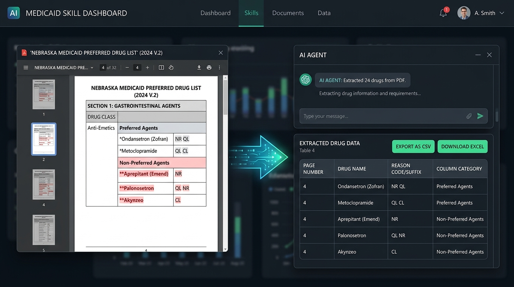

# Nebraska Medicaid Preferred Drug List (PDL) Redline Extraction Skill

A specialized tool and AI Agent Skill for parsing the Nebraska DHHS Preferred Drug List (PDL) PDF. It automatically identifies red-text drug additions and status changes, isolates superscript suffix codes (`NR`, `CL`, `QL`, `AL`), maps entries into `Preferred Agents` vs. `Non-Preferred Agents`, and exports structured CSV / Excel tables.

<p align="center">
  
</p>

---

## Privacy & Synthetic Data Statement

> [!IMPORTANT]
> **Protected Health Information (PHI) & Data Privacy Disclaimer:**
> Any references to patient data, clinical scenarios, and sample PDF test fixtures within this project and SKILL are **entirely synthetic in nature**. This repository processes public formulary reference documents and does not contain, store, or process any real Protected Health Information (PHI) or Personally Identifiable Information (PII).

---

## How to Use this SKILL with an AI Agent (No Coding Required)

If you are using an AI Agent (such as Gemini Enterprise, Antigravity, or any agent harness supporting Skills), **you do not need any Python or programming experience**. 

The AI agent will automatically read this skill and run the data extraction for you behind the scenes.

> [!TIP]
> **Dynamic Monthly Updates:**
> The skill automatically queries the official Nebraska DHHS portal (`https://nebraska.fhsc.com/PDL/PDLlistings.asp`) to identify and download the newest monthly PDF publication (e.g., `NE_PDL-YYYYMMDD.pdf`). When Nebraska updates the list in subsequent months, the skill will automatically find and process the newest file without needing any manual link updates.

### 1. Simple Plain-English Prompts
Just talk to your AI agent in natural language. Here are examples of what you can ask:

* **Extract the latest changes to an Excel file:**
  > *"Analyze the latest Nebraska Medicaid PDL and export all redline drug changes to an Excel spreadsheet."*

* **Get a quick summary table directly in your chat:**
  > *"Extract all red-text drugs with their reason codes from the Nebraska PDL and show me the table here."*

* **Process a specific PDF link or document:**
  > *"Use the Nebraska PDL redline skill to extract drug changes from this link: https://nebraska.fhsc.com/downloads/PDL/NE_PDL-20260803.pdf"*

* **Analyze specific pages:**
  > *"Find all redline drug additions on pages 1 through 25 of the Nebraska PDL."*

### 2. What the Agent Delivers
The agent will automatically generate a clean, structured table with the following information:
- **Page Number**: The PDF page where the drug was found.
- **Drug Name**: Clean drug name in plain text (e.g., `tapentadol SOLN`, `buprenorphine PATCH`).
- **Reason Code / Suffix**: Cleaned reason codes (`NR`, `QL`, `CL`, `AL`, `NR, QL`, or `None`).
- **Column Category**: Identifies if the drug is in `Preferred Agents` or `Non-Preferred Agents`.
- **Export File**: A ready-to-download `.csv` or `.xlsx` spreadsheet file upon request.

---

## Features

- **Character-Level Graphic Fill Color Filtering**: Accurately targets pure red text (`RGB: 1.0, 0.0, 0.0`) without being fooled by basic plain-text extractors.
- **Superscript & Suffix Splitting**: Separates base drug names from superscript reason codes by detecting font size drops (`>= 1.5pt`) and baseline vertical shifts (`>= 1.8pt`).
- **Embedded Suffix Handling**: Correctly extracts reason codes placed between brand/generic names and dosage forms (e.g. `LIPFENDRA (enlicitide)NR,QL TAB` -> `LIPFENDRA (enlicitide) TAB` with suffix `NR, QL`).
- **Multi-line Wrapping**: Intelligently stitches multi-line drug entries (e.g. `AWIQLI (insulin icodec-abae) \n FLEXTOUCH PENNR`) while preserving consecutive distinct red items as separate rows.
- **Header, Footer & Notes Exclusion**: Automatically ignores document headers ("Highlights"), footers ("CL – Prior Authorization... Page X of Y"), and non-drug criteria.
- **Dual Export Support**: Exports clean, formatted tables to CSV (`.csv`) and Microsoft Excel (`.xlsx`).

---

## Directory Structure

```text
.
├── CODE_OF_CONDUCT.md               # Healthcare data ethics, privacy & PHI governance
├── LICENSE                           # Apache License, Version 2.0
├── SKILL.md                          # Skill definition & runbook for AI agents
├── README.md                         # Project documentation & non-technical guide
├── requirements.txt                  # Python dependencies
├── assets/
│   ├── skill_in_action.jpg           # Visual demonstration of the skill in action
│   └── skill_pipeline_architecture.jpg # End-to-end skill architecture diagram
├── scripts/
│   ├── extract_redline_pdl.py        # Core extraction engine & CLI
│   ├── generate_sample_pdf.py        # Mock sample PDF generator
│   └── run_tests.py                  # Standalone test runner
├── tests/
│   ├── __init__.py
│   └── test_pdl_extractor.py         # Pytest test suite (13 unit & integration tests)
├── examples/
│   ├── sample_pdl.pdf                # 3-page sample PDF mimicking NE PDL layout
│   ├── sample_output.csv             # Example CSV extraction output
│   └── sample_output.xlsx            # Example Excel extraction output
└── references/
    ├── pdl_format_spec.md            # Technical PDF geometry & layout specification
    └── reason_codes.md               # DHHS reason codes reference guide
```

---

## Technical Setup & Developer Usage (Optional)

For developers and technical users who wish to run the underlying Python code directly:

### 1. Installation

Ensure Python 3.10+ is installed, then install dependencies:

```bash
pip install -r requirements.txt
```

### 2. Command-Line Interface (CLI)

```bash
# Extract from official URL and save to CSV
python3 scripts/extract_redline_pdl.py "https://nebraska.fhsc.com/downloads/PDL/NE_PDL-20260803.pdf" -o redline_drugs.csv --summary

# Extract from local PDF and save to Excel
python3 scripts/extract_redline_pdl.py examples/sample_pdl.pdf --excel redline_drugs.xlsx --summary

# Filter specific page ranges
python3 scripts/extract_redline_pdl.py sample_real_pdl.pdf --pages 1-10,41,63 -o output.csv
```

### 3. Python API

```python
from scripts.extract_redline_pdl import extract_pdl_redline

# Process PDF from local path or URL
df = extract_pdl_redline("examples/sample_pdl.pdf")

# Inspect results
print(df.to_string(index=False))

# Export to CSV or Excel
df.to_csv("extracted_drugs.csv", index=False)
df.to_excel("extracted_drugs.xlsx", index=False, engine="openpyxl")
```

---

## Testing

Run the automated test suite:

```bash
python3 scripts/run_tests.py
# or
pytest -v tests/test_pdl_extractor.py
```

### Generating the Mock Sample PDF
To regenerate or inspect the sample test PDF:

```bash
python3 scripts/generate_sample_pdf.py
```

---

## License

This project is licensed under the **Apache License, Version 2.0**. See the [LICENSE](./LICENSE) file for the complete license terms and conditions.

---

## Code of Conduct

We are committed to strict healthcare data protection, privacy safeguards, and synthetic test data compliance. All participants, contributors, and maintainers are expected to adhere to the guidelines outlined in the [CODE_OF_CONDUCT.md](./CODE_OF_CONDUCT.md).
